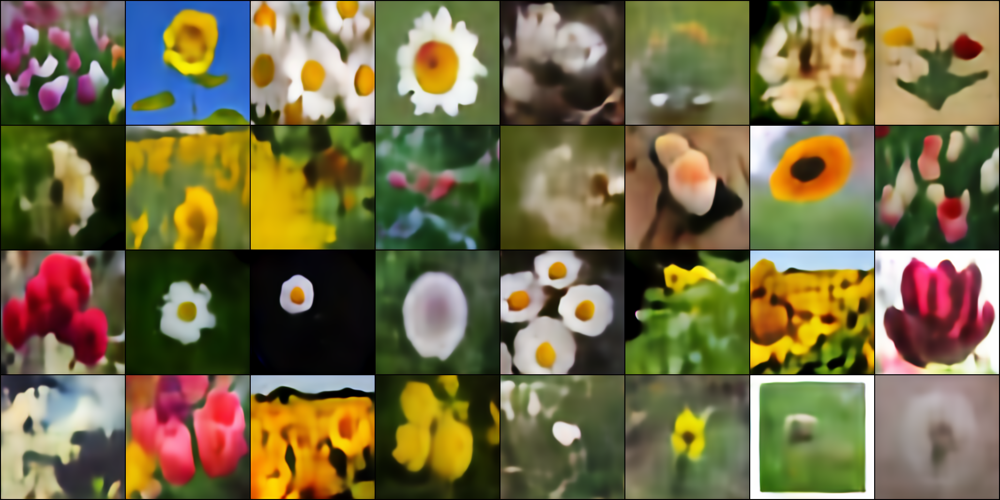
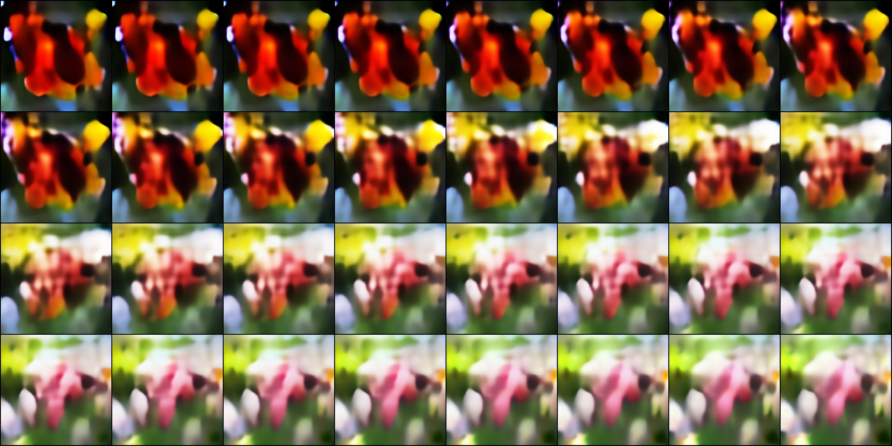

# Variational Autoencoder
Variational autoencoders are a method to learn the underlying distribution of data samples and to sample from that distribution, thus generate artificial data samples which follow the same distribution as your samples.

The above samples are generated from training a VAE with a  [flower dataset](https://www.kaggle.com/datasets/alxmamaev/flowers-recognition) published on Kaggle and then drawing samples from the learned distribution.

## Classic Autoencoders
An autoencoder is a neural network that learns a compressed representation of the input data. The network typically consists of two parts. The encoder part maps the input data to a latent space with lower dimensionality. The decoder part uses this latent data representation and learns a mapping back to the original space. 

Imaging an image of size 256x256 with three color channels. This represents 196.608 input dimensions (256x256x3). Further imaging a convolutional neural network that maps this input image to a 4096-dimensional vector space. This would represent a ~98% reduction in dimensionality. 
## The network architecture
### Downsampling
Downsampling is handeled by two [convolutional layers](https://pytorch.org/docs/stable/generated/torch.nn.Conv2d.html?highlight=conv2d#torch.nn.Conv2d) with a [GELU](https://pytorch.org/docs/stable/generated/torch.nn.GELU.html?highlight=gelu) activiation in between. [Batch normalization](https://pytorch.org/docs/stable/generated/torch.nn.BatchNorm2d.html?highlight=batch+normalization) is employed to support better gradient flow. After the double convolutions, 2x2 [max-pooling](https://pytorch.org/docs/stable/generated/torch.nn.MaxPool2d.html?highlight=maxpool2d) is used to reduce the spatial extent of the data.

    class Down(nn.Module):
      def __init__(self, in_channels, mid_channels, out_channels):
        super().__init__()
        self.relu = nn.GELU()
        self.fw = nn.Sequential(
          nn.Conv2d(in_channels=in_channels, out_channels=mid_channels, kernel_size=(3,3), padding='same'),
          nn.BatchNorm2d(num_features=mid_channels),
          nn.GELU(),
          nn.Conv2d(in_channels=mid_channels, out_channels=out_channels, kernel_size=(3,3), padding='same'),
          nn.BatchNorm2d(num_features=out_channels),
          nn.MaxPool2d(kernel_size=(2,2),stride=(2,2))
        )

      def forward(self, x):
        return self.fw(x)

NOTE that the second GELU activation after convolution is missing here as the output of this operation will also be used differently later. In the actual autoencoder architecture, the activation will be added back in, though. 

### Upsampling
Upsampling is handeled by a bilinear upsampling of the previous feature mapes plus a sequence of two convolution layers with GELU activiations and batch normalization.

    class Up(nn.Module):
      def __init__(self, in_channels, mid_channels, out_channels):
        super().__init__()
        self.relu = nn.GELU()
        self.fw = nn.Sequential(
          nn.BatchNorm2d(num_features=in_channels),
          nn.GELU(),      
          nn.Upsample(scale_factor=2, mode="bilinear", align_corners=True),
          nn.Conv2d(in_channels=in_channels, out_channels=mid_channels, kernel_size=(3,3), padding='same'),
          nn.BatchNorm2d(num_features=mid_channels),
          nn.GELU(),
          nn.Conv2d(in_channels=mid_channels, out_channels=out_channels, kernel_size=(3,3), padding='same')
        )

      def forward(self, x):
        return self.fw(x)

### The encoder
The encoder is a sequence of down-convolutions (see above) followed by two fully-connected layers outputing the compressed embedding. A classical autoencoder would only output the MU component and learn to reconstruct the original image from that. Our variational autoencoder learns to reconstruct samples a gaussian distribution and thus the encoder outputs the parameters of said distribution, namely $\mu$ and $\sigma$.

    class Encoder(nn.Module):
      def __init__(self):
        super().__init__()
        self.encoder = nn.Sequential(
          Down( 3,  8,  8), nn.GELU(),
          Down( 8, 16, 16), nn.GELU(),
          Down(16, 32, 32), nn.GELU(),
          Down(32, 64, 64), nn.GELU(),
          Down(64, 128, 128), nn.GELU(),
          Down(128, 256, 256), nn.GELU(),
          nn.Flatten(),
        )
        self.mu = nn.Linear(4096, 4096)
        self.std = nn.Linear(4096, 4096)

      def forward(self, x):
        x = self.encoder(x)
        return self.mu(x), torch.exp(self.std(x))

### The decoder
The decoder takes a 4096-dimensional embedding in the latent space and reconstructs the original image by a sequence of up-convolutions (see above) followed by a hyperbolic tangens as the final activiation layer (too make sure outputs stay between -1 and +1).

    class Decoder(nn.Module):
      def __init__(self):
        super().__init__()
        self.linear = nn.Linear(4096, 4096)
        self.gelu = nn.GELU()
        self.decoder = nn.Sequential(
          Up(256, 256, 128), 
          Up(128, 128, 64), 
          Up(64, 64, 32), 
          Up(32, 32, 16), 
          Up(16, 16, 16),
          Up(16, 16, 3),
        )
        self.tanh = nn.Tanh()

      def forward(self, x):
        x = self.gelu(self.linear(x))
        return self.tanh(self.decoder(x.view(-1,256,4,4)))

### The VAE itself
The variational autoencoder itself is then straight forward to define. First, encode the target image with the encoder. Then we draw a random samples from the gaussian distribution defined by $\mu$ and $\sigma$. Finally, we decode the drawn sample using the decoder

    class VAE(nn.Module):    
      def __init__(self):
        super().__init__()
        self.dist = torch.distributions.Normal(0, 1)
        self.dist.loc = self.dist.loc.cuda()
        self.dist.scale = self.dist.scale.cuda()
        self.encoder = Encoder()
        self.decoder = Decoder()

      def forward(self, x):
        mu, std = self.encoder(x)
        z = mu + std * self.dist.sample(mu.shape)
        x = self.decoder(z)
        self.kl = (std**2 + mu**2 - torch.log(std) - 1).mean()
        return x 

## Regularizing the latent space
If we would just train the VAE with, for example, a mean-square error loss on the reconstructed image (compared to the original one), the optimal strategy for the VAE would be to zero the standard deviation $\sigma$ as that would allow to pass deterministic information from the encoder to the decoder via the $\mu$ part of the encoding. This, however, would yield a highly unstructured latent space. We can regularize the latent space by forcing the VAE to assume a certain (Gaussian in this case) distribution. The gaussian would be fully defined by $\mu$ and $\sigma$ and we calculate the Kullback-Leibler divergence between the actual and the target distribution. For a Gaussian with $\mu=0$ and $\sigma=1$, this KL-divergence is given by

    self.kl = (std**2 + mu**2 - torch.log(std) - 1).mean()

We add this term to the overall loss.

## The loss
It is well [known](https://arxiv.org/pdf/2001.03444.pdf) that a pure MSE (mean-squared error) loss on the resulting reconstructed data vs the original data does yield blurry samples. This is due to a vanishing gradient problem when the reconstructed image is very similar to the target image. With pure MSE loss, the network tends to learn "averaged" samples, thus the blurry look. 

To improve the visual quality of the obtained samples, various measures have been proposed in literature. 

### L1-Norm
Using L1 norm instead of L2 norm for the loss prevents the vanishing gradient problem for samples closely resembling the appearance of the target. 

    loss_function = nn.L1Loss()

### Perceptual loss
It has been shown that the sample quality can be improved by feeding both the target and the reconstructed image through a well-trained, unrelated neural network and train the VAE to resemble all or part of the inner embeddings as well... this is enforced by adding the L1 mean error between the target and reconstructed embeddings. In this toy example, a simple deep neural network is trained to discriminate the five flower classes and the embeddings of that network are used as additional guidance for the VAE

    class Perception(nn.Module):
    def __init__(self):
      super().__init__()
      self.gelu = nn.GELU()
      self.d1 = Down( 3,  8,  8)    
      self.d2 = Down( 8, 16, 16)    
      self.d3 = Down(16, 32, 32)    
      self.d4 = Down(32, 64, 64)    
      self.d5 = Down(64, 128, 128) 
      self.d6 = Down(128, 256, 256)
      self.flatten = nn.Flatten()

      self.linear1 = nn.Linear(1024, 512).to(device)
      self.dropout = nn.Dropout()
      self.linear2 = nn.Linear(512, 5).to(device)

    def forward(self, x):
      x = self.d1(x)
      emb1 = self.flatten(x)
      x = self.d2(self.gelu(x))
      emb2 = self.flatten(x) / 2
      x = self.d3(self.gelu(x))
      emb3 = self.flatten(x) / 3
      x = self.d4(self.gelu(x))    
      emb4 = self.flatten(x) / 4
      x = self.d5(self.gelu(x))    
      emb5 = self.flatten(x) / 5
      x = self.d6(self.gelu(x))    
      emb6 = self.flatten(x) / 6

      x = self.gelu(self.linear1(self.flatten(self.gelu(x))))
      x = self.linear2(self.dropout(x))
      
      emb = torch.cat([emb1, emb2, emb3, emb4, emb5, emb6],dim=1)
      return F.log_softmax(x, dim=1), emb

This network is used to calculate the embeddings for each batch

    
    x, _ = model(batch)
    
    with torch.no_grad():
      _, gt_emb = perception(batch)    
    , mdl_emb = perception(x)

### Variational loss
TO further supress noise in the reconstructed image, a total variation loss term is added

    class TotalVariationLoss(nn.Module):
      def __init__(self):
        super().__init__()

      def forward(self, x):
        x = F.pad(x, (0, 1, 0, 1), 'replicate')
        x_diff = x[..., :-1, :-1] - x[..., :-1, 1:]
        y_diff = x[..., :-1, :-1] - x[..., 1:, :-1]
        diff = x_diff**2 + y_diff**2
        return diff.mean()

### Summary
With the above, the overall loss term becomes

    loss = 5 * loss_function(x, batch) + loss_function(mdl_emb, gt_emb) + 0.5 * tvloss(x) + model.kl

## Training
Training itself is done using the Adam optimizer with a constant learning rate of 0.001. On a single GPU, training can take very long (>24 hours) so a natural follow-up of this project would be to enable multi-GPU training.

## Interpolation in the latent space
Since the latent space is properly regularized, it is possible to decode interpolated samples within that space to smoothly morph samples into each other. The below image is an example of this interpolation in the latent space.

